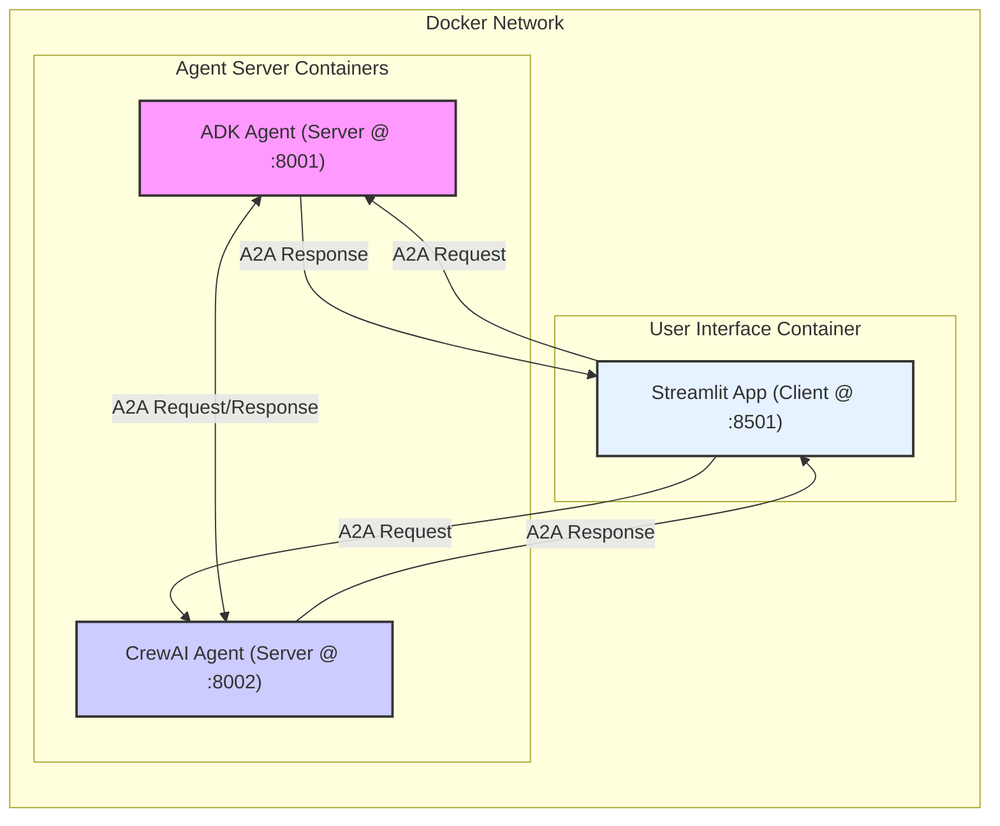

# ADK と CrewAI を用いた A2A 通信サンプル

## 概要

このプロジェクトは、Google Agent Development Kit (ADK) で作成されたエージェントと、CrewAI フレームワークで作成されたエージェントが、Agent2Agent (A2A) プロトコルを用いて相互に通信するサンプル実装です。

Streamlitを用いたチャットUIから各エージェントに指示を送れるほか、エージェント同士が直接通信する基盤も構築されており、異なるフレームワーク間の連携と相互運用性の基礎をデモンストレーションすることを目的としています。

Docker Compose を使用して、各コンポーネント（ADKエージェント、CrewAIエージェント、Streamlitアプリ）をコンテナとして起動します。

### 全体構成

Streamlitアプリが各エージェントサーバーにA2Aリクエストを送信し、同期的な応答を受け取ります。加えて、ADKエージェントとCrewAIエージェントは、互いに直接A2Aメッセージを送受信する能力を持っています（現在のサンプルでは主に起動時の疎通確認で使用）。


*矢印はコンテナ間のA2A通信を示します。*

## ディレクトリ構成

```
a2a_adk_crewai_impl/
├── third_party/google_a2a/ # Google A2Aリポジトリ (サブモジュール)
├── adk_agent/            # ADKエージェント関連
│   ├── main.py
│   ├── adk_config.yaml
│   ├── pyproject.toml
│   └── Dockerfile
├── crewai_agent/         # CrewAIエージェント関連
│   ├── main.py
│   ├── crewai_config.yaml
│   ├── pyproject.toml
│   └── Dockerfile
├── a2a_streamlit_app/    # StreamlitチャットUI関連
│   ├── main.py
│   ├── a2a_client_utils.py
│   ├── state_manager.py
│   ├── pyproject.toml
│   └── Dockerfile
├── compose.yaml          # Docker Compose設定ファイル
└── README.md             # このファイル
```
*注: 共通コード (`third_party/google_a2a/samples/python/common`) は、`compose.yaml` の設定により各コンテナ内の `/app/common` にマウントされ、`PYTHONPATH` を通じてインポートされます。*

## 環境構築

1.  **前提条件:**
    *   Docker および Docker Compose (または Docker Desktop)
    *   Git

2.  **リポジトリのクローン:**
    ```bash
    git clone <このプロジェクトのリポジトリURL> a2a_adk_crewai_impl
    cd a2a_adk_crewai_impl
    ```

3.  **Google A2A サブモジュールの準備:**
    ```bash
    # サブモジュールを初期化・更新
    git submodule update --init --recursive
    ```
    *このプロジェクトでは `third_party/google_a2a/samples/python/common` 内のコードを利用します。*

4.  **(オプション) `.env` ファイルの作成:**
    CrewAIエージェントが将来的に外部LLM APIキーなどを必要とする場合に備え、プロジェクトルートに `.env` ファイルを作成して環境変数を定義できます (例: `OPENAI_API_KEY=your_key`)。`compose.yaml` で読み込む設定を追加する必要があります。

## 実行方法

プロジェクトルート (`a2a_adk_crewai_impl`) で以下のコマンドを実行します。

```bash
docker compose up --build
```

これにより、以下のサービスがコンテナとして起動します。

*   **ADKエージェント:** `http://localhost:8001` でA2Aリクエストを待ち受けます。
*   **CrewAIエージェント:** `http://localhost:8002` でA2Aリクエストを待ち受けます。
*   **Streamlitアプリ:** `http://localhost:8501` でアクセス可能なUIを提供します。

コンテナを停止するには、`docker compose down` を実行します。

## 期待される動作

1.  `docker compose up` を実行すると、各サービスのイメージがビルドされ、コンテナが起動します。
2.  各エージェントコンテナのログに、起動メッセージと、もう一方のエージェントへの初期テストメッセージ送信および**同期的な応答**受信のログが出力されます。
3.  ブラウザで `http://localhost:8501` にアクセスすると、Streamlitアプリが表示されます。
4.  サイドバーでエージェントのURL (`http://adk_agent:8001` または `http://crewai_agent:8002` - コンテナ名でアクセス) を追加すると、Agent Card情報が表示されます。
5.  エージェントを選択しメッセージを送信すると、選択されたエージェントコンテナのログにリクエスト受信ログが出力され、Streamlitアプリのチャット履歴にエージェントからの**同期的な応答**（現在はモック応答）が表示されます。

## 留意事項

*   この実装は基本的なメッセージ送受信のデモンストレーションです。実際の CrewAI や ADK のタスク実行ロジックは含まれていません (`TaskManager` はダミー/モック実装です)。
*   **CrewAIエージェントは現在モック実装です。** A2Aリクエストを受け取ると、実際のCrewAIプロセス（LLM呼び出しなど）を実行する代わりに、固定の応答を返します。LLM連携を含む完全な実装は今後の課題です。
*   エラーハンドリングやセキュリティ対策は最小限です。
*   A2Aプロトコルは開発中のため、仕様変更により動作しなくなる可能性があります。
*   共通コード (`common`) はサブモジュールから読み取り専用でマウントされています。共通コード自体を修正する場合は、サブモジュールリポジトリで行う必要があります。