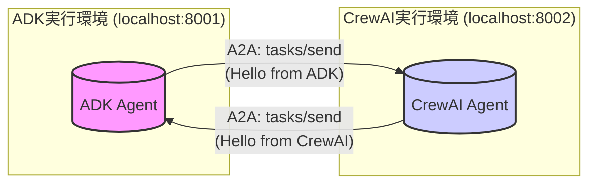

# ADK と CrewAI を用いた A2A 通信サンプル実装ノート

## 1. 目的

異なるエージェントフレームワークである Google Agent Development Kit (ADK) と CrewAI を使用し、Agent2Agent (A2A) プロトコルに基づいた基本的な双方向通信（テキストメッセージ送受信）を実現するサンプルを実装する。これにより、フレームワーク間の相互運用性を検証する。

## 2. 実装概要

### 2.1. 目標

*   ADKエージェントとCrewAIエージェント間で、A2Aプロトコルを用いた基本的なテキストメッセージを送受信する。

### 2.2. 構成

ADKエージェントとCrewAIエージェントは、それぞれ独立したPythonプロセスとして実行され、A2Aプロトコルに従って直接通信する。各エージェントはA2Aサーバー機能（待ち受け）とA2Aクライアント機能（送信）を持つ。



起動時に互いにテストメッセージを送信し、正常に送受信できることを確認する。

## 3. フレームワーク選定の背景

A2Aプロトコル対応状況を主要フレームワークについて調査した結果（2025年4月時点）、ADK（Google公式）とCrewAI（公式リポジトリにサンプル有）が最も確実に対応していると判断し、この組み合わせを選定した。

*調査対象: ADK, CrewAI, LangGraph, LangChain, AutoGen, UAgent(Fetch.ai)*
*調査結果詳細は `docs/research_notes/a2a_framework_research_20250417_141700.md` を参照。*

**注意:** A2Aプロトコルおよび各フレームワークの対応状況は変化する可能性があるため、最新情報を要確認。

## 4. 環境構築

### 4.1. 前提条件

*   Python >= 3.12
*   uv (Python Package Installer and Resolver)
*   Git

### 4.2. プロジェクトディレクトリ準備

```bash
mkdir a2a_adk_crewai_impl
cd a2a_adk_crewai_impl
```

### 4.3. Google A2A リポジトリのクローン

A2Aプロトコル仕様、共通コード、サンプルを含むリポジトリをプロジェクト内にクローンする。

```bash
git clone https://github.com/google/A2A.git A2A_repo
```
*このリポジトリ内の `common` ディレクトリのコードを利用する。*

### 4.4. Python 環境準備 (uv)

プロジェクトルートでPython 3.12を使用するよう設定（必要に応じてインストール）。

```bash
# プロジェクトルート (a2a_adk_crewai_impl) で実行
# uv python install 3.12
```

### 4.5. 依存関係管理 (uv ワークスペース)

`adk_agent`, `crewai_agent`, `A2A_repo/samples/python` をメンバーとする `uv` ワークスペースを定義する。これにより、ローカルの共通コード (`A2A_repo/samples/python` 内) への依存関係を管理する。

```toml:a2a_adk_crewai_impl/pyproject.toml
[build-system]
requires = ["hatchling"]
build-backend = "hatchling.build"

[project]
name = "a2a-adk-crewai-impl-workspace" # Workspace root placeholder name
version = "0.1.0"
requires-python = ">=3.12"

[tool.uv.workspace]
members = [
    "adk_agent",
    "crewai_agent",
    "A2A_repo/samples/python" # Provides 'a2a-samples' package
]
```

### 4.6. 依存関係のインストール (uv sync)

プロジェクトルートで以下を実行し、全メンバーの依存関係を解決・インストールする。

```bash
# プロジェクトルート (a2a_adk_crewai_impl) で実行
uv sync --all-members
```
*これにより、各エージェントディレクトリ (`adk_agent`, `crewai_agent`) 内に `.venv` が作成され、必要なパッケージがインストールされる。*

**注意:** 実装時には `httpx` のバージョン競合が発生したため、`A2A_repo/samples/python/pyproject.toml` の `httpx` バージョン指定を `>=0.23.0` に修正した。依存関係エラーが発生した場合は、各 `pyproject.toml` を確認すること。

## 5. 実装コード解説

### 5.1. 共通コンポーネントの活用

Google A2Aリポジトリ (`A2A_repo/samples/python`) 内の以下を利用。

*   `common/server/server.py`: `A2AServer` (Starlette/Uvicornベース)
*   `common/client/client.py`: `A2AClient` (httpxベース)
*   `common/types.py`: A2AプロトコルのPydanticモデル
*   `common/server/task_manager.py`: `TaskManager` 抽象基底クラス

これらは `uv` ワークスペース経由で `a2a-samples` パッケージとして参照される。

### 5.2. ADKエージェント (`adk_agent/main.py`)

*   **設定読み込み:** `adk_config.yaml` からAgent ID, port, 接続先情報をロード。
*   **`AgentCard` 定義:** `common.types.AgentCard` に従い定義。必須フィールド (`name`, `url`, `version`, `capabilities`, `skills`) を設定。
*   **`TaskManager` 実装:** `AdkTaskManager` として `TaskManager` を継承。`on_send_task` で受信リクエストをログ出力し、受信メッセージを含む `Task` オブジェクトをレスポンス (`JSONRPCResponse`) として返す。
*   **A2Aサーバー起動:** `A2AServer` をインスタンス化し、`uvicorn.Server` と `asyncio` を使って非同期起動。
*   **メッセージ送信:** `A2AClient` を使い、`send_initial_message` 関数内で接続先 (CrewAI) に `tasks/send` リクエストを送信。`TaskSendParams` に必須の `id` (UUID) と `message` を含める。

```python
# Key parts of adk_agent/main.py
import uuid
from common.server.server import A2AServer
from common.server.task_manager import TaskManager
from common.types import AgentCard, AgentCapabilities, AgentSkill, Task, TaskStatus, TaskState, Message, TextPart, JSONRPCResponse, SendTaskRequest
from common.client.client import A2AClient
import asyncio
import uvicorn
import yaml
import logging

# ... (TaskManager, load_config, send_initial_message implementations) ...

async def main():
    # ... (Load config) ...
    agent_card = AgentCard(...) # Define AgentCard
    task_manager = AdkTaskManager()
    server = A2AServer(...) # Instantiate server
    uvicorn_config = uvicorn.Config(...)
    uvicorn_server = uvicorn.Server(uvicorn_config)
    server_task = asyncio.create_task(uvicorn_server.serve())
    await asyncio.sleep(2) # Wait for server start
    await send_initial_message(target_config) # Send message
    await server_task # Keep running

if __name__ == "__main__":
    asyncio.run(main())
```

### 5.3. CrewAIエージェント (`crewai_agent/main.py`)

ADKエージェントとほぼ同様の構成。主な違いは以下。

*   `TaskManager` クラス名 (`CrewAiTaskManager`)
*   `AgentCard` の `name`, `description`
*   `send_initial_message` の接続先ポート (`8001`)

### 5.4. 依存関係管理 (`pyproject.toml`)

*   **ルート (`a2a_adk_crewai_impl/pyproject.toml`):** `[tool.uv.workspace]` でメンバー (`adk_agent`, `crewai_agent`, `A2A_repo/samples/python`) を定義。
*   **ADKエージェント (`adk_agent/pyproject.toml`):**
    ```toml
    [project]
    dependencies = [
        "a2a-samples", # Workspace dependency
        "pyyaml", "uvicorn", "starlette", "sse-starlette", "pydantic",
        "google-adk",
    ]
    [tool.uv.sources]
    a2a-samples = { workspace = true }
    ```
*   **CrewAIエージェント (`crewai_agent/pyproject.toml`):**
    ```toml
    [project]
    dependencies = [
        "a2a-samples", # Workspace dependency
        "pyyaml", "uvicorn", "starlette", "sse-starlette", "pydantic",
        "crewai",
    ]
    [tool.uv.sources]
    a2a-samples = { workspace = true }
    ```

**注意点:**

*   `uv` はネストされたワークスペースをサポートしないため、`A2A_repo/samples/python/pyproject.toml` から `[tool.uv.workspace]` を削除した。
*   `a2a-samples` と `crewai` の `httpx` バージョン競合のため、`A2A_repo/samples/python/pyproject.toml` の `httpx` 指定を `>=0.23.0` に変更した。

## 6. 動作確認

### 6.1. 実行手順

1.  **ターミナル1: CrewAI エージェント起動**
    ```bash
    cd /path/to/a2a_adk_crewai_impl/crewai_agent
    uv run python main.py
    ```
    *(サーバーが `http://0.0.0.0:8002` で起動)*

2.  **ターミナル2: ADK エージェント起動**
    ```bash
    cd /path/to/a2a_adk_crewai_impl/adk_agent
    uv run python main.py
    ```
    *(サーバーが `http://0.0.0.0:8001` で起動)*

### 6.2. 期待されるログ出力

*   両エージェントが起動し、互いに `tasks/send` リクエストを送信。
*   各エージェントログに、相手への送信ログ (`Sending test message...`)、相手からのレスポンス受信ログ (`Received response...`、`message` 含む)、相手からのリクエスト受信ログ (`Received SendTask request...`) がエラーなく表示される。

## 7. 考察・課題

*   **A2A連携:** ADKとCrewAI間で基本的なメッセージ交換が可能であることを確認。
*   **共通コンポーネント:** Google A2Aリポジトリの共通コードはA2A実装の負担を軽減する上で有用。
*   **`uv` ワークスペース:** ローカル依存関係管理に有効だが、ネスト非対応や依存関係指定方法 (`{ workspace = true }`) に注意が必要。
*   **依存関係競合:** `httpx` のバージョン競合が発生。バージョン調整で対応。
*   **プロトコル理解:** `pydantic` モデル (`AgentCard`, `Task`, `TaskStatus` 等) の正確な理解と利用が重要。特にレスポンス形式 (`Task` オブジェクト、`message` 含む `TaskStatus`)。
*   **非同期処理:** `asyncio` と `uvicorn` の連携 (`uvicorn.Server`, `await server.serve()`)。
*   **その他:** 実装過程で `pydantic` バリデーションエラー、`asyncio` ランタイムエラー、`uv` 設定エラー、依存関係競合などが複数発生。エラーメッセージの確認と試行錯誤により解決。
