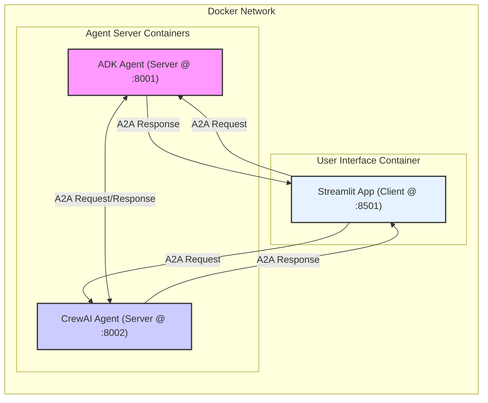

# ADK と CrewAI を用いた A2A 通信サンプル実装ノート

## 1. 目的

異なるエージェントフレームワークである Google Agent Development Kit (ADK) と CrewAI を使用し、Agent2Agent (A2A) プロトコルに基づいた基本的な双方向通信（テキストメッセージ送受信）を実現するサンプルを実装する。これにより、フレームワーク間の相互運用性を検証する。コンテナ化により、環境構築の容易化と共通コードの効率的な管理を目指す。

## 2. 実装概要

### 2.1. 目標

*   ADKエージェント、CrewAIエージェント、Streamlit UIをそれぞれDockerコンテナとして起動する。
*   各コンテナからサブモジュール内の共通コードを参照可能にする。
*   Streamlit UIから各エージェントへA2Aリクエストを送信し、同期的な応答を受信する。
*   エージェント間でA2Aメッセージを送受信する（起動時の疎通確認）。

### 2.2. 構成

Docker Compose を使用して3つのサービス（ADKエージェント、CrewAIエージェント、Streamlitアプリ）を起動する。共通コード (`third_party/google_a2a/samples/python/common`) はVolumeマウントを通じて各コンテナ内の `/app/common` に配置され、`PYTHONPATH` 設定によりインポート可能になる。



## 3. フレームワーク選定の背景

A2Aプロトコル対応状況を主要フレームワークについて調査した結果（2025年4月時点）、ADK（Google公式）とCrewAI（公式リポジトリにサンプル有）が最も確実に対応していると判断し、この組み合わせを選定した。

*調査対象: ADK, CrewAI, LangGraph, LangChain, AutoGen, UAgent(Fetch.ai)*
*調査結果詳細は `docs/research_notes/a2a_framework_research_20250417_141700.md` を参照。*

## 4. 環境構築 (Docker Compose)

### 4.1. 前提条件

*   Docker および Docker Compose
*   Git

### 4.2. リポジトリとサブモジュールの準備

```bash
git clone <このプロジェクトのリポジトリURL> a2a_adk_crewai_impl
cd a2a_adk_crewai_impl
git submodule update --init --recursive
```

### 4.3. コンテナのビルドと起動

プロジェクトルートで `docker compose up --build` を実行する。

## 5. 実装コード解説

### 5.1. 依存関係管理と共通コード参照

*   **方針:** Docker ComposeとVolumeマウント、PYTHONPATH設定により、サブモジュール内の共通コードを各コンテナから直接インポートする方式を採用。これによりコード重複を回避。
*   **共通コード:** サブモジュール `third_party/google_a2a/samples/python/common` を各コンテナの `/app/common` にマウント。
*   **`PYTHONPATH`:** 各コンテナの環境変数 `PYTHONPATH=/app` を設定。
*   **`pyproject.toml`:** 各アプリケーションの `pyproject.toml` には、アプリケーション固有の依存関係のみを記述。共通コードへの依存や共通コード自体の依存ライブラリは記述しない。
*   **Dockerfile:** `uv` 公式イメージをベースとし、`uv sync` で各アプリ固有の依存関係のみをインストール。

### 5.2. ADKエージェント (`adk_agent/main.py`)

*   `from common...` でマウントされた共通コードをインポート。
*   `on_send_task` でリクエストを受け取り、同期的に処理結果（モック応答＋履歴）を含む `Task` オブジェクトをレスポンスとして返す。
*   起動時に `send_initial_message` で相手 (CrewAI) に `tasks/send` リクエストを送信。

### 5.3. CrewAIエージェント (`crewai_agent/main.py`)

*   ADKエージェントと同様の構成。
*   `on_send_task` 内で、CrewAIの `Agent`, `Task`, `Crew` をインスタンス化するが、`kickoff()` はLLMなしで実行（またはエラーハンドリング）し、固定のモック応答文字列を含む `Task` オブジェクトを同期的に返す。**（モック実装）**

### 5.4. Streamlitアプリ (`a2a_streamlit_app/`)

*   `a2a_client_utils.py` で `from common...` を使用してマウントされた共通クライアントコードをインポート。
*   `main.py` で `send_a2a_task` を呼び出し、選択されたエージェントに `tasks/send` リクエストを送信。
*   エージェントからの同期的な応答 (`Task` オブジェクト) を受け取り、チャット履歴に表示。

## 6. 動作確認

1.  プロジェクトルートで `docker compose up --build` を実行。
2.  各コンテナログで起動と初期通信を確認。
3.  ブラウザで `http://localhost:8501` にアクセス。
4.  サイドバーでエージェントURL (`http://adk_agent:8001` または `http://crewai_agent:8002`) を追加。
5.  エージェントを選択しメッセージを送信。チャット履歴に応答（モック）が表示されることを確認。

## 7. 考察・課題

*   **コンテナ化:** 共通コードの重複を避け、環境分離を実現。`PYTHONPATH` とVolumeマウントでサブモジュールコードを利用できた。
*   **依存関係:** アプリ固有の依存関係のみを各 `pyproject.toml` で管理。共通コードの依存はコンテナ環境では `PYTHONPATH` 経由での利用のため明示的なインストール不要となった。
*   **プロトコル理解:** `tasks/send` の同期応答の形式 (`Task` オブジェクト) を正しく返す必要があった。
*   **CrewAIモック:** LLMなしでの `kickoff()` 実行はエラーになる可能性があり、エラーハンドリングを追加したモック実装とした。

## 8. 今後の課題

*   **CrewAIの実際のロジック実装:** `crewai_agent/main.py` のモック処理をLLM連携を含む実装に置き換える。
*   **エラーハンドリング強化。**
*   **セキュリティ実装。**
*   **共通コードの依存関係:** 共通コード側で依存関係が追加された場合、それを各アプリの `pyproject.toml` に追加するか、共通コード自体をビルドしてパッケージとしてインストールする方式に変更する必要がある。
