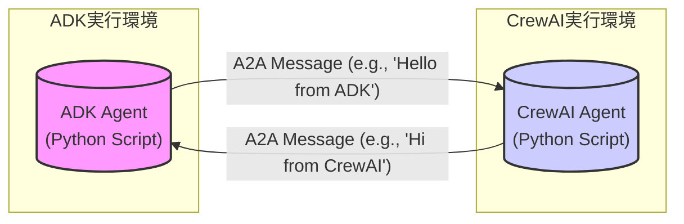

# ADKとCrewAIを用いたA2A実装計画 (改訂版)

## 1. 目標
ADK (Agent Development Kit) で作成したエージェントと、CrewAIで作成したエージェント間で、Agent2Agent (A2A) プロトコルを用いた基本的なメッセージ送受信（テキストメッセージ）を実現する。これにより、異なるフレームワーク間のエージェント連携の基礎を確立する。

## 2. 全体構成図

*   ADKエージェントとCrewAIエージェントは、それぞれ独立したPythonプロセスとして実行されることを想定します。
*   両エージェントは、A2Aプロトコルに従ってTCP/IP（または設定に応じたトランスポート層）経由で直接通信します。

## 3. 実装ステップ

### ステップ 1: 環境構築とプロジェクト準備
   - **1.1 Python環境準備 (uv):**
     - `uv` がインストールされていない場合はインストールします。
     - プロジェクトルートディレクトリを作成します (例: `mkdir a2a_adk_crewai_impl && cd a2a_adk_crewai_impl`)。
     - `uv python install 3.12` を実行し、Python 3.12系の最新版をインストールします。
   - **1.2 プロジェクトディレクトリ構成:**
     - プロジェクトルート内に、ADK用 (`adk_agent`) とCrewAI用 (`crewai_agent`) のサブディレクトリを作成します。
   - **1.3 ADK環境セットアップ (uv):**
     - `adk_agent` ディレクトリに移動します: `cd adk_agent`
     - 仮想環境を作成します: `uv init`
     - GoogleのA2Aリポジトリをクローンまたはダウンロードします: `git clone https://github.com/google/A2A.git ../A2A_repo` (プロジェクト外など適切な場所に)
     - ADKのコアライブラリや依存関係を `uv add` でインストールします (例: `uv add ../A2A_repo/python/adk` や必要な依存ライブラリ)。※ A2Aリポジトリの構成に応じてパスやパッケージ指定を調整してください。
     - `cd ../` でプロジェクトルートに戻ります。
   - **1.4 CrewAI環境セットアップ (uv):**
     - `crewai_agent` ディレクトリに移動します: `cd crewai_agent`
     - 仮想環境を作成します: `uv init`
     - CrewAIをインストールします: `uv add crewai`
     - CrewAIの基本的なエージェントが動作するか、簡単なサンプルコードで確認します。
     - 参考: [CrewAI Documentation](https://docs.crewai.com/)
     - `cd ../` でプロジェクトルートに戻ります。

### ステップ 2: A2Aプロトコル理解とサンプル分析
   - **2.1 A2Aプロトコル仕様精読:**
     - [Google A2A SPEC.md](https://github.com/google/A2A/blob/main/SPEC.md) を読み込み、以下の点を重点的に理解します。
       - **Agent ID:** エージェントの一意な識別方法。
       - **Transport:** 通信の基盤 (TCP, WebSocketsなど)。
       - **Handshake:** エージェント間の接続確立プロセス。
       - **Message Format:** 送受信されるメッセージの構造 (JSON形式、必須フィールドなど)。
       - **Core Capabilities:** 基本的なメッセージ交換 (`SendMessage`)。
   - **2.2 CrewAI A2Aサンプル分析:**
     - `A2A_repo/samples/python/agents/crewai/` ディレクトリ内のコードを詳細に分析します。
     - CrewAIエージェントがどのようにA2Aサーバーを起動し、メッセージを送受信しているかを確認します。
     - 設定ファイル (`config.py` など) の役割を理解します。
   - **2.3 ADK A2A関連コード調査:**
     - ADKライブラリ内でA2A通信に関連するモジュールや関数を探します (例: `a2a.py`, `transport.py` など)。
     - ADK側でA2Aメッセージを送受信するためのAPIやクラスを特定します。

### ステップ 3: ADKエージェント実装 (A2A対応)
   - **3.1 `adk_agent` ディレクトリ準備:**
     - `adk_agent` ディレクトリに必要なファイル (Pythonスクリプト、設定ファイル等) を配置します。
   - **3.2 A2Aリスナー実装:**
     - ADKの機能を使って、指定したポートでA2A接続を待ち受けるサーバー機能を実装します。
     - 接続が確立したらハンドシェイク処理を行います。
     - 受信したA2Aメッセージをパースし、内容 (送信元Agent ID、メッセージ本文など) をコンソールにログ出力する機能を実装します。
   - **3.3 A2Aメッセージ送信実装:**
     - CrewAIエージェントのAgent IDとアドレス (ホスト名/IPアドレス、ポート番号) を指定して接続を開始する機能を実装します。
     - 接続後、ハンドシェイクを行います。
     - シンプルなテキストメッセージ (例: "Hello from ADK Agent!") を含むA2Aメッセージを作成し、送信する機能を実装します。
   - **3.4 設定ファイル:**
     - ADKエージェント自身のAgent ID、待ち受けポート、接続先CrewAIエージェントのアドレスなどを設定ファイル (例: `adk_config.yaml`) で管理できるようにします。

### ステップ 4: CrewAIエージェント実装 (A2A対応)
   - **4.1 `crewai_agent` ディレクトリ準備:**
     - `crewai_agent` ディレクトリに必要なファイル (Pythonスクリプト、設定ファイル等) を配置します。
   - **4.2 A2Aリスナー実装 (サンプル活用):**
     - `A2A_repo/samples/python/agents/crewai/` のサンプルコードをベースに、A2A接続を待ち受ける機能を実装します。
     - 受信したメッセージをパースし、内容をコンソールにログ出力します。
   - **4.3 A2Aメッセージ送信実装 (サンプル活用):**
     - サンプルコードを参考に、ADKエージェントのAgent IDとアドレスを指定して接続し、メッセージ (例: "Hi from CrewAI Agent!") を送信する機能を実装します。
   - **4.4 設定ファイル:**
     - CrewAIエージェント自身のAgent ID、待ち受けポート、接続先ADKエージェントのアドレスなどを設定ファイル (例: `crewai_config.yaml`) で管理できるようにします。

### ステップ 5: 統合テストとデバッグ
   - **5.1 個別起動確認:**
     - ADKエージェントとCrewAIエージェントをそれぞれ個別に起動し、エラーなく待ち受け状態になることを確認します。
   - **5.2 通信テスト (片方向):**
     - ADKエージェントを起動し、次にCrewAIエージェントを起動してADKエージェントにメッセージを送信させます。ADK側でログが出力されるか確認します。
     - 逆方向 (ADK -> CrewAI) も同様にテストします。
   - **5.3 通信テスト (双方向):**
     - 両エージェントを起動し、互いにメッセージを送り合い、両方のコンソールで受信ログが出力されることを確認します。
   - **5.4 デバッグ:**
     - 接続エラー、メッセージ形式エラー、タイムアウトなどが発生した場合、各エージェントのログ、A2Aプロトコル仕様、コード実装を確認し、原因を特定して修正します。
     - Wiresharkなどのパケットキャプチャツールを使用すると、通信内容のデバッグに役立つ場合があります。

### ステップ 6: ドキュメント作成と整理
   - **6.1 `README.md` 作成:**
     - プロジェクトルートに `README.md` を作成し、以下の情報を記載します。
       - プロジェクトの目的
       - ディレクトリ構成
       - 環境構築手順 (`uv` コマンド含む)
       - 設定ファイルの記述方法
       - 各エージェントの起動方法 (`uv run ...` など)
       - 簡単な使い方と期待される動作
   - **6.2 コードコメント:**
     - 実装したコードの主要な部分、特にA2A関連の処理に分かりやすいコメントを追加します。
   - **6.3 最終確認:**
     - ドキュメントの手順に従って、他の環境でも再現可能か確認します。

## 4. 成果物
- `a2a_adk_crewai_impl/` ディレクトリ一式
  - `adk_agent/`: ADKエージェントのソースコード、設定ファイル、`pyproject.toml`, `uv.lock`
  - `crewai_agent/`: CrewAIエージェントのソースコード、設定ファイル、`pyproject.toml`, `uv.lock`
  - `README.md`: プロジェクトの説明と利用手順書
- (オプション) Dockerfile: 各エージェントをコンテナ化する場合

## 5. 留意事項
- **プロトコルのバージョン:** A2Aプロトコルは開発中のため、仕様変更があり得ます。Google A2Aリポジトリの最新情報を確認してください。
- **エラーハンドリング:** 本計画では基本的な送受信を目標としており、詳細なエラーハンドリング (接続断、不正なメッセージ等) は含みません。必要に応じて後続フェーズで実装します。
- **セキュリティ:** A2Aプロトコル自体に認証・暗号化の規定はありますが、本計画の初期実装では考慮しません。実運用ではセキュリティ対策が必須です。
- **非同期処理:** エージェント間の通信は非同期で行われるため、Pythonの `asyncio` などの非同期ライブラリの知識が必要になる可能性があります。